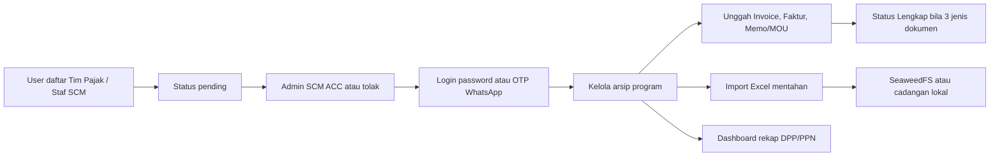
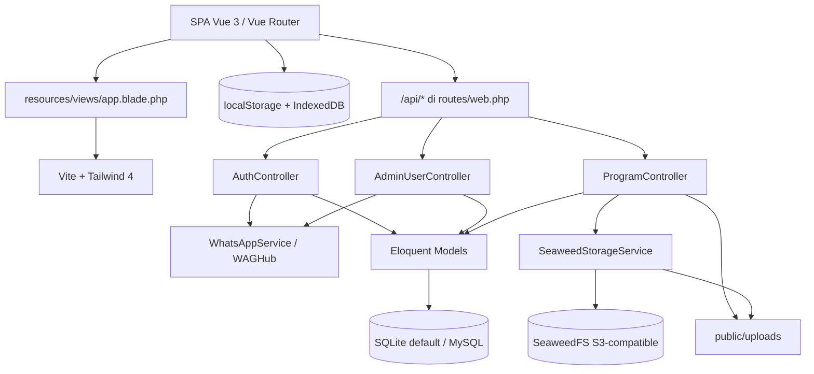

<p align="center">
  
</p>

<h1 align="center">SCM TaxVault</h1>

<p align="center">
  Aplikasi internal arsip dokumen program SCM dan rekap perpajakan:
  invoice, faktur pajak, memo/MOU, kelengkapan audit, import Excel, serta
  manajemen user dengan persetujuan Admin.
</p>

SCM TaxVault menyediakan satu SPA Vue di root aplikasi, dengan REST API di `/api` yang dipakai frontend yang sama.

Bahasa UI adalah Bahasa Indonesia. Zona waktu aplikasi mengikuti konfigurasi Laravel (`UTC` pada `config/app.php`), bukan `Asia/Jakarta`.

> [!IMPORTANT]
> SCM TaxVault adalah aplikasi internal. Endpoint `/api/*` saat ini **tidak memakai middleware autentikasi**, CSRF dikecualikan untuk `api/*`, dan sesi Laravel hanya dibuat pada jalur verifikasi OTP. Jangan membuka aplikasi ke klien yang tidak tepercaya sebelum authorization API dan guard frontend selesai.

## Daftar isi

- [Tujuan dan scope](#tujuan-dan-scope)
- [Fitur utama](#fitur-utama)
- [Role dan hak akses](#role-dan-hak-akses)
- [Cara kerja aplikasi](#cara-kerja-aplikasi)
- [Arsitektur](#arsitektur)
- [Tech stack](#tech-stack)
- [Persiapan development](#persiapan-development)
- [Konfigurasi environment](#konfigurasi-environment)
- [Menjalankan aplikasi](#menjalankan-aplikasi)
- [API](#api)
- [Workflow development](#workflow-development)
- [Testing dan quality check](#testing-dan-quality-check)
- [Batasan dan technical debt](#batasan-dan-technical-debt)
- [Troubleshooting](#troubleshooting)

## Tujuan dan scope

SCM TaxVault menyatukan arsip program pengadaan/logistik SCM dengan kelengkapan dokumen pajak. Alur utamanya: user disetujui Admin, program dicatat beserta DPP/PPN/total, tiga dokumen wajib diunggah, lalu dashboard menampilkan kelengkapan dan rekap nilai.

### Termasuk dalam scope

- Pendaftaran akun (`Tim Pajak` atau `Staf SCM`) dengan status `pending`.
- Persetujuan (ACC), penolakan, dan hapus user oleh Admin SCM.
- Login email/kata sandi dan login OTP WhatsApp.
- CRUD program: nama, supplier, NPWP, kategori, nomor invoice, DPP, PPN, total, tanggal, status.
- Unggah dan pratinjau tiga jenis dokumen: Invoice, Faktur Pajak, Memo/MOU.
- Import Excel/CSV program, dengan salinan file mentahan ke SeaweedFS/S3 atau cadangan lokal.
- Ekspor arsip program ke `.xlsx` (SheetJS) atau CSV.
- Dashboard metrik DPP/PPN, kelengkapan, supplier teratas, dan daftar program yang perlu tindakan.

### Di luar scope implementasi saat ini

- Panel admin Filament; UI operasional adalah SPA Vue.
- Sanctum, SSO, reset password mandiri, dan API token.
- Pipeline CI/CD, Docker Compose, Octane, dan scheduler bisnis.
- Integrasi DJP Online / e-Faktur resmi; validasi kode faktur di halaman Pengaturan bersifat tampilan.
- Payroll, kontrak hukum native, dan e-sign.
- Filter tahun pajak pada dashboard; dropdown tahun belum mengubah query data.

## Fitur utama

| Modul | SPA Vue | API `/api` | Keterangan |
|---|:---:|:---:|---|
| Dashboard arsip dan rekap pajak | Ya | Ya | Metrik dihitung di frontend dari daftar program; API `GET /programs` juga mengirim ringkasan |
| Arsip program (CRUD) | Ya | Ya | Frontend punya fallback localStorage jika API gagal |
| Unggah dokumen program | Ya | Ya | File disimpan di `public/uploads/documents`; preview juga memakai IndexedDB |
| Hapus dokumen | Ya | Parsial | Method controller ada; **route DELETE belum terdaftar** di `routes/web.php` |
| Import Excel/CSV | Ya | Ya | Parsing di browser (SheetJS CDN); backend menerima JSON baris + file mentah |
| Ekspor Excel/CSV | Ya | Tidak | Hanya di client (`exportToCsv`) |
| Login password | Ya | Parsial | Validasi lewat `POST /auth/validate-password`; sesi Laravel tidak dibuat pada jalur ini |
| OTP WhatsApp | Ya | Ya | Gateway WAGHub; OTP 6 digit berlaku 5 menit |
| Registrasi publik | Ya | Ya | Role yang bisa diajukan hanya `Tim Pajak` dan `Staf SCM` |
| Manajemen user / ACC | Ya (Admin) | Ya | Guard halaman `/users` hanya di Vue Router + localStorage |
| Pengaturan tarif PPN | Ya | Tidak | Halaman `/settings` ada, tidak tertaut di sidebar, tidak tersimpan ke backend |
| Storage file mentahan | Ya | Ya | SeaweedFS/S3 path-style; fallback `public/uploads/mentahan_excel` |

> [!NOTE]
> Nama produk di UI adalah **SCM TaxVault**. Status kelengkapan program memakai dua nilai backend: `Lengkap` dan `Perlu Tindakan`. Frontend menampilkan turunan `Lengkap` / `Sebagian` / `Belum Lengkap` berdasarkan jumlah dokumen.

## Role dan hak akses

Role yang dipakai kode:

| Role | Sumber | Akses UI |
|---|---|---|
| `Admin SCM` | Seeder atau dibuat admin | Dashboard, arsip, manajemen user, ACC pendaftaran |
| `Tim Pajak` | Registrasi atau seeder | Dashboard dan arsip; tidak melihat menu Manajemen User |
| `Staf SCM` | Registrasi atau seeder | Dashboard dan arsip; tidak melihat menu Manajemen User |

Status akun: `pending`, `approved`, `rejected`. Login ditolak untuk `pending` dan `rejected`.

Pengecekan admin di frontend adalah `role === 'Admin SCM'` atau string role mengandung `"admin"` (case-insensitive). Backend `User::isAdmin()` hanya mencocokkan `Admin SCM`.

Source of truth data user/program adalah database. Frontend juga menyimpan salinan di localStorage:

- `scm_taxvault_user_v2` — user yang sedang “login”
- `scm_taxvault_users_list_v2` — daftar user (termasuk password pada fallback lokal)
- `scm_taxvault_programs_v2` — cache program

Jika localStorage user kosong, store mengisi default user pertama (Admin SCM seeder). Router **tidak** mewajibkan login untuk `/dashboard` atau `/programs`; yang dijaga hanya `/users`.

Akun `admin@scm.corp` tidak dapat dihapus lewat `DELETE /api/admin/users/{id}`.

## Cara kerja aplikasi



### 1. Pendaftaran dan ACC

1. Calon user membuka `/register` dan mengisi nama, WhatsApp, email, role (`Tim Pajak` atau `Staf SCM`), serta kata sandi minimal 6 karakter.
2. `POST /api/auth/register` membuat user `status=pending`, mengisi `division` dan `initials`, lalu mengirim notifikasi WhatsApp “pendaftaran diterima”.
3. Admin membuka `/users` atau modal persetujuan, lalu `POST /api/admin/users/{id}/approve` atau `/reject`.
4. Approve mengisi `approved_by`, `approved_at`, dan mengirim WhatsApp “akun disetujui”.
5. Admin juga dapat menambah user langsung lewat `POST /api/admin/users` dengan status `approved` (role bebas string, termasuk `Admin SCM`).

### 2. Login

Ada dua tab di `/login`.

**Email & kata sandi**

1. `POST /api/auth/validate-password` memeriksa email, password, dan status.
2. Akun demo (`admin@scm.corp`, `auditor@pajak.corp`, `staff@scm.corp`) dan setiap user ber-role `Admin SCM` langsung `loginDirect` ke localStorage **tanpa** `Auth::login`.
3. Akun reguler lain, setelah password valid, tetap diminta OTP WhatsApp.

**WhatsApp / email OTP**

1. `POST /api/auth/send-otp` mencari user dari email atau nomor (`08…` / `62…`).
2. OTP 6 digit disimpan di tabel `otps`, kedaluwarsa 5 menit, dikirim lewat WAGHub.
3. Response JSON saat ini **mengembalikan field `otp`**.
4. `POST /api/auth/verify-otp` menandai OTP terpakai, memanggil `Auth::login`, dan mengembalikan data user.
5. Kode `123456` diterima sebagai fallback demo untuk user `approved` pertama bila OTP asli tidak ketemu.

Logout di Topbar hanya menghapus localStorage; `POST /api/auth/logout` tidak dipanggil dari UI.

### 3. Siklus arsip program

1. Program dibuat dari sheet “Tambah Program” atau import Excel.
2. Field wajib di API store: nama program (`title` / `program_name`) dan `supplier`.
3. Jika PPN kosong, backend (dan parser Excel) mengisi `dpp * 0.11`. Total default `dpp + ppn`.
4. ID program adalah string, biasanya angka berurutan; bukan UUID.
5. Tiga dokumen wajib di UI:
   - Frontend: `invoice`, `faktur_pajak`, `mou`
   - Backend: `invoice`, `faktur`, `memo`
6. Unggah file ke `public/uploads/documents`. Satu jenis dokumen per program ditimpa (`updateOrCreate` pada `program_id` + `type`).
7. Backend menandai `status = Lengkap` jika jumlah **jenis unik** dokumen `>= 3`, selain itu `Perlu Tindakan`.
8. Frontend menghitung kelengkapan dari `documents.length` (3 = Lengkap), bukan dari jenis unik.

Kategori yang muncul di data seeder antara lain Logistik, IT & Software, Distribusi, Pengadaan Material, Operasional, dan Jasa Konsultasi.

### 4. Import dan file mentahan

1. Modal import membaca `.xlsx` / `.xls` / `.csv` di browser (SheetJS dari CDN).
2. Kolom yang dikenali (nama fleksibel): PROGRAM, SUPPLIER/VENDOR, NO. INVOICE, DPP, PPN, TOTAL INVOICE, NPWP, KATEGORI, TANGGAL.
3. Baris dikirim ke `POST /api/programs/import` sebagai JSON, plus file asli bila ada.
4. File mentah diunggah `SeaweedStorageService` ke bucket S3-compatible (path-style), dengan salinan `public/uploads/mentahan_excel`.
5. Metadata tersimpan di `raw_imports`. Download mencoba lokal, lalu SeaweedFS, lalu redirect `file_url`.
6. Import memakai `updateOrCreate` berdasarkan `id`; baris dengan id yang sama menimpa program lama.

### 5. Dashboard

Dashboard menampilkan:

- Jumlah program, total DPP, total PPN, total invoice, program siap audit
- Grafik rekap DPP & PPN per bulan
- Supplier teratas
- Peringatan dokumen belum lengkap

Perhitungan utama ada di `resources/js/store/taxStore.js` (`summaryMetrics`, `needAttentionPrograms`). Dropdown “Tahun Pajak 2025/2024” belum memfilter data.

## Arsitektur



### Peta source code

| Lokasi | Tanggung jawab |
|---|---|
| `resources/js/views` | Halaman SPA: login, dashboard, arsip, detail, users, settings |
| `resources/js/components` | Layout, tabel program, upload, dashboard, UI primitives |
| `resources/js/store/taxStore.js` | State klien, pemetaan API, fallback localStorage |
| `resources/js/router/index.js` | Route SPA dan guard `/users` |
| `resources/js/utils/documentDb.js` | Blob dokumen di IndexedDB |
| `app/Http/Controllers/Api` | Endpoint auth, admin user, program, import |
| `app/Models` | `User`, `Otp`, `Program`, `ProgramDocument`, `RawImport` |
| `app/Services/WhatsAppService.php` | Kirim OTP dan notifikasi ACC via WAGHub |
| `app/Services/SeaweedStorageService.php` | Upload/download SigV4 ke SeaweedFS/S3 |
| `database/migrations` | Schema users SCM, otp, programs, documents, raw_imports |
| `database/seeders/ScmDataSeeder.php` | User demo dan 18 program contoh |
| `routes/web.php` | API `/api` dan catch-all SPA |
| `tests` | Skeleton Laravel; belum menutupi domain SCM |

## Tech stack

| Komponen | Teknologi |
|---|---|
| Backend | PHP >=8.2, Laravel 12 |
| Frontend | Vue 3, Vue Router 4, Vite 7 |
| UI | Tailwind CSS 4, radix-vue, lucide-vue-next |
| HTTP klien | `fetch` native di store; Axios terpasang tetapi bukan jalur utama domain |
| Database | SQLite untuk local default; MySQL/MariaDB didukung lewat `.env` |
| Session | Driver `database` (tabel `sessions`) |
| Auth API | Session web pada `verifyOtp` / `logout`; endpoint lain tanpa guard |
| WhatsApp | WAGHub `POST /api/v1/messages` |
| Object storage | SeaweedFS S3-compatible (AWS SigV4 di service kustom, bukan Flysystem) |
| Excel | SheetJS `xlsx` dari CDN di `app.blade.php` |
| Test | PHPUnit 11 / `php artisan test` |

## Persiapan development

### Prasyarat

- Git.
- PHP 8.2 atau lebih baru (8.4 sudah diuji di environment pengembang).
- Composer 2.
- Node.js 22 LTS direkomendasikan (Vite 7).
- SQLite untuk setup local default; MySQL 8+ atau MariaDB untuk deployment bersama.
- Extension PHP: `curl`, `fileinfo`, `mbstring`, `openssl`, `pdo_sqlite` (local/test) atau `pdo_mysql`.

WAGHub dan SeaweedFS bersifat opsional untuk UI dasar; tanpa keduanya, OTP/notifikasi gagal diam-diam dan file mentahan jatuh ke cadangan lokal.

### Clone dan dependency

```bash
git clone https://github.com/oceanspacedev/scm-arsip-web.git
cd scm-arsip-web
git switch main

composer install
cp .env.example .env
php artisan key:generate
npm ci
```

Jangan menjalankan `composer update` hanya untuk setup; gunakan versi yang dikunci `composer.lock`.

### Konfigurasi database

`.env.example` memakai SQLite. Buat file database bila langkah setup dijalankan manual:

```bash
php -r "file_exists('database/database.sqlite') || touch('database/database.sqlite');"
```

Untuk MySQL/MariaDB:

```dotenv
APP_NAME="SCM TaxVault"
APP_ENV=local
APP_DEBUG=true
APP_URL=http://127.0.0.1:8000

DB_CONNECTION=mysql
DB_HOST=127.0.0.1
DB_PORT=3306
DB_DATABASE=scm_arsip
DB_USERNAME=root
DB_PASSWORD=
```

### Fresh onboarding

Pastikan `.env` menunjuk ke database development yang kosong, lalu:

```bash
php artisan migrate
php artisan db:seed --class=ScmDataSeeder
```

> [!WARNING]
> `php artisan migrate --seed` **tidak** mengisi data SCM. `DatabaseSeeder` masih membuat `test@example.com` dari factory, dan **tidak** memanggil `ScmDataSeeder`. Jangan menjalankan `migrate:fresh` / `db:wipe` pada database berisi data produksi.

`ScmDataSeeder` idempotent untuk email/id yang sama (`updateOrCreate`). Akun development:

| Email | Password | Role | Status |
|---|---|---|---|
| `admin@scm.corp` | `password123` | Admin SCM | approved |
| `auditor@pajak.corp` | `password123` | Tim Pajak | approved |
| `staff@scm.corp` | `password123` | Staf SCM | approved |
| `reza25022003@gmail.com` | `password123` | Tim Pajak | pending |

Ganti password itu segera di environment bersama. Seeder juga membuat 18 program contoh (campuran `Lengkap` dan `Perlu Tindakan`).

## Konfigurasi environment

Jangan commit `.env` atau credential ke Git.

| Variabel | Wajib | Fungsi |
|---|:---:|---|
| `APP_KEY` | Ya | Kunci enkripsi Laravel |
| `APP_URL` | Ya | Base URL; dipakai URL file unggahan |
| `DB_CONNECTION` / `DB_*` | Ya | Driver database; default proyek `sqlite` |
| `SESSION_DRIVER` | Ya | Default `database` |
| `CACHE_STORE` | Ya | Default `database` |
| `QUEUE_CONNECTION` | Ya | Default `database`; UI saat ini tidak mengantrekan job domain |
| `FILESYSTEM_DISK` | Ya | Default Laravel `local`; unggah dokumen **tidak** memakai disk ini, melainkan `public/uploads` |
| `WAG_URL` | Untuk OTP/WA | Base URL WAGHub, tanpa trailing slash |
| `WAG_TOKEN` | Untuk OTP/WA | Bearer token WAGHub |
| `AWS_ACCESS_KEY_ID` / `AWS_SECRET_ACCESS_KEY` | Untuk SeaweedFS | Access key S3-compatible |
| `AWS_BUCKET` | Untuk SeaweedFS | Nama bucket; service men-lowercase saat path |
| `AWS_DEFAULT_REGION` | Tidak | Default `us-east-1` |
| `AWS_ENDPOINT` | Untuk SeaweedFS | Endpoint API S3 |
| `AWS_URL` | Untuk SeaweedFS | Base URL publik objek |
| `AWS_USE_PATH_STYLE_ENDPOINT` | Untuk SeaweedFS | Service membaca env ini; default di kode `true` |

> [!WARNING]
> `WhatsAppService` dan `SeaweedStorageService` masih punya **nilai default di source** bila env kosong. Isi env secara eksplisit dan jangan mengandalkan default di kode. Jangan menaruh secret baru di repository.

Untuk local tanpa WhatsApp/SMTP:

```dotenv
MAIL_MAILER=log
WAG_URL=
WAG_TOKEN=
```

OTP tetap bisa diuji lewat field `otp` pada response `send-otp` (perilaku saat ini, bukan kontrak yang diinginkan) atau kode demo `123456`.

## Menjalankan aplikasi

Jalankan backend dan Vite pada terminal terpisah:

```bash
# Terminal 1
php artisan serve
```

```bash
# Terminal 2
npm run dev
```

Buka:

- Aplikasi: `http://127.0.0.1:8000/login`
- Health check: `http://127.0.0.1:8000/up`

Queue worker tidak wajib untuk fitur domain saat ini. Sebagai alternatif, `composer run dev` menjalankan server Laravel, queue listener, log viewer, dan Vite bersama-sama.

Setelah build production (`npm run build`), SPA tetap dilayani Laravel lewat catch-all `/{any?}` yang mengembalikan view `app`.

## API

Base URL:

```text
http://127.0.0.1:8000/api
```

Route API didefinisikan di [`routes/web.php`](routes/web.php) (bukan `routes/api.php`). CSRF dikecualikan untuk `api/*` di `bootstrap/app.php`. Tidak ada prefix `/api/v1` dan tidak ada Sanctum.

Daftar endpoint:

| Method | Path | Fungsi |
|---|---|---|
| `POST` | `/api/auth/register` | Daftar akun pending |
| `POST` | `/api/auth/send-otp` | Kirim OTP WhatsApp |
| `POST` | `/api/whatsapp/send-otp` | Alias `send-otp` |
| `POST` | `/api/auth/verify-otp` | Verifikasi OTP + `Auth::login` |
| `POST` | `/api/auth/validate-password` | Cek email/password tanpa membuat sesi |
| `GET` | `/api/auth/me` | User session Laravel, bila ada |
| `POST` | `/api/auth/logout` | Invalidate session Laravel |
| `GET` | `/api/admin/users` | Daftar user + `pending_count` |
| `POST` | `/api/admin/users` | Tambah user approved |
| `POST` | `/api/admin/users/{id}/approve` | ACC |
| `POST` | `/api/admin/users/{id}/reject` | Tolak |
| `DELETE` | `/api/admin/users/{id}` | Hapus user |
| `GET` | `/api/programs` | Daftar program + metrics |
| `POST` | `/api/programs` | Buat program |
| `GET` | `/api/programs/{id}` | Detail |
| `PUT` | `/api/programs/{id}` | Ubah |
| `DELETE` | `/api/programs/{id}` | Hapus program + dokumen |
| `POST` | `/api/programs/{id}/documents` | Unggah dokumen |
| `POST` | `/api/programs/import` | Import JSON + file mentahan |
| `GET` | `/api/programs/raw-imports` | Riwayat file mentahan |
| `GET` | `/api/programs/raw-imports/{id}/download` | Unduh file mentahan |
| `DELETE` | `/api/programs/raw-imports/{id}` | Hapus record mentahan (file fisik tidak selalu dihapus) |

Frontend memanggil `DELETE /api/programs/{id}/documents/{docType}`, tetapi route itu belum didaftarkan.

Contoh validasi password:

```bash
curl --request POST http://127.0.0.1:8000/api/auth/validate-password \
  --header 'Accept: application/json' \
  --header 'Content-Type: application/json' \
  --data '{
    "email": "admin@scm.corp",
    "password": "password123"
  }'
```

Response domain umumnya:

```json
{
  "success": true,
  "message": "Operasi berhasil.",
  "user": {},
  "program": {},
  "programs": [],
  "metrics": {}
}
```

Bentuk field tidak seragam di semua endpoint (kadang `user`, kadang `program`, kadang `programs`). Update memakai `PUT`; tidak ada `PATCH`.

Untuk melihat route aktual:

```bash
php artisan route:list --path=api
```

## Workflow development

Konvensi branch saat README ini diperbarui:

- `main`: branch default remote `origin`.
- Branch pekerjaan: buat dari `main` dengan pola `feat/<scope>`, `fix/<scope>`, atau `docs/<scope>`.

```bash
git switch main
git pull --ff-only origin main
git switch -c feat/<nama-fitur>
```

### Lokasi perubahan berdasarkan jenis fitur

| Kebutuhan | Lokasi umum |
|---|---|
| Tambah/ubah tabel | `database/migrations` dan `app/Models` |
| Integrasi WhatsApp / storage | `app/Services` |
| Endpoint API | Controller di `app/Http/Controllers/Api` + `routes/web.php` |
| Halaman / alur UI | `resources/js/views` dan `components` |
| State klien dan pemetaan API | `resources/js/store/taxStore.js` |
| Guard halaman | `resources/js/router/index.js` |
| Data development | `database/seeders/ScmDataSeeder.php` |
| Verifikasi | `tests/Feature` atau `tests/Unit` |

### Aturan implementasi

- Jangan mengubah schema melalui migration yang sudah berjalan di shared environment; tambahkan migration baru.
- Jangan menaruh token WAGHub, kunci S3, atau password demo di source PHP/JS.
- Endpoint yang mengubah data harus mendapat authorization server-side; visibilitas menu Vue bukan boundary keamanan.
- Perubahan env wajib diikuti `.env.example` dan README, tanpa secret.
- Bila menambah route hapus dokumen, daftarkan di `routes/web.php` agar sesuai pemanggilan frontend.
- Tambahkan test regresi untuk perbaikan bug.

### Definition of Done

Sebelum membuka PR:

- Aktor dan status akun yang boleh mengakses sudah jelas.
- Migration punya `up()` / `down()` yang aman.
- Empty state, validasi 422, dan fallback localStorage tidak menyembunyikan kegagalan diam-diam pada fitur baru.
- `npm run build` berhasil bila ada perubahan frontend.
- Tidak ada `.env`, token, dump, atau data pribadi di commit.

## Testing dan quality check

`phpunit.xml` mengunci test ke SQLite in-memory, cache/session array, queue sync, dan mail array.

```bash
php artisan test
php artisan test --filter=NamaTest
```

Test yang ada saat ini adalah skeleton Laravel (`GET /` mengembalikan 200, unit `true === true`). Belum ada coverage auth, program, atau import.

Quality check yang tersedia di proyek:

```bash
vendor/bin/pint --test
composer validate --strict
npm run build
```

Tidak ada PHPStan/Larastan atau Rector di repository ini.

## Batasan dan technical debt

Daftar ini adalah perilaku aktual, bukan fitur yang dijanjikan:

1. **API publik tanpa auth middleware.** Siapa pun yang mencapai `/api` dapat membaca/mengubah user, program, dan unggahan.
2. **Login password tidak membuat sesi Laravel.** Identitas UI dipegang localStorage. `GET /api/auth/me` hanya terisi setelah OTP.
3. **Router hampir tanpa auth.** `/dashboard` dan `/programs` bisa dibuka tanpa login; default store dapat mengisi Admin SCM.
4. **OTP bocor di response JSON** dan kode `123456` diterima sebagai fallback demo.
5. **Secret default di source.** `WhatsAppService` dan `SeaweedStorageService` punya fallback token/kunci di kode.
6. **Password user tersimpan di localStorage** pada jalur fallback.
7. **Route hapus dokumen belum ada**, sementara UI dan method controller sudah ada.
8. **`DatabaseSeeder` tidak memanggil `ScmDataSeeder`.**
9. **Kelengkapan frontend vs backend tidak identik** (`documents.length` vs jumlah jenis unik).
10. **Unggahan ke `public/uploads`** dapat diakses langsung lewat URL tanpa auth.
11. **Halaman `/settings` tidak di sidebar** dan tarif PPN tidak dipersist.
12. **Filter tahun pajak dashboard tidak berfungsi.**
13. **Logout UI tidak memanggil** `POST /api/auth/logout`.
14. **Tidak ada Docker, CI, monitoring, atau backup terpaket.**
15. **Timezone `UTC`**, sementara copy UI berbahasa Indonesia / konteks pajak Indonesia.
16. **Test domain belum ada.**

Gunakan bagian ini sebagai checklist pertama untuk hardening.

## Troubleshooting

### Halaman kosong atau `Vite manifest not found`

```bash
npm ci
npm run dev
```

Untuk meniru production:

```bash
npm run build
php artisan optimize:clear
```

### Database kosong / login demo gagal

Pastikan `ScmDataSeeder` sudah dijalankan, bukan hanya `DatabaseSeeder`:

```bash
php artisan db:seed --class=ScmDataSeeder
```

### OTP WhatsApp tidak sampai

1. Isi `WAG_URL` dan `WAG_TOKEN`.
2. Periksa `storage/logs/laravel.log` untuk error WAGHub.
3. Nomor dinormalisasi `08…` → `62…` di service.
4. Development masih bisa memakai OTP di JSON response atau `123456` — jangan biarkan ini di production.

### Import Excel gagal di browser

SheetJS dimuat dari CDN di `resources/views/app.blade.php`. Jika CDN diblokir, unggah `.csv` atau pastikan `window.XLSX` tersedia.

### File mentahan tidak terunduh

Urutan lookup: `public/uploads/mentahan_excel/{basename file_key}` → SeaweedFS `getObject` → redirect `file_url`. Periksa `AWS_*` dan isi folder unggahan.

### Perubahan config tidak terbaca

```bash
php artisan optimize:clear
```

---

README ini mendokumentasikan perilaku pada branch `main`. Bila alur auth, storage, kelengkapan dokumen, atau kontrak API berubah, perbarui README pada PR yang sama.
